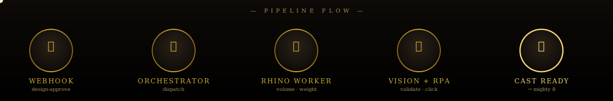

<div align="center">

<!-- ═══════════════════════════════════════════════════════════════
     ANIMATED HERO BANNER — rotating 3D gem, gold shimmer, particles
     ═══════════════════════════════════════════════════════════════ -->



<br/>

<!-- TYPED TITLE EFFECT -->
<a href="https://github.com/mabdullahab614-alt/devils-tech-rpa">
  
</a>

<br/>

<!-- TAGLINE -->
<p>
  <em>From Rhino model to casting tray — without lifting a finger.</em>
</p>

<br/>

<!-- BADGES — gold-themed, custom -->
<p>
  
  
  
  
</p>

<p>
  
  
  
</p>


</div>

<br/>

## ✦ The Vision

<table>
<tr>
<td width="55%" valign="top">

A jewelry CAD design lands on your bench. You need to **approve** it, **weigh** it in 22K gold, and **send it to the caster** — Mighty 8 or Nano Tech.

Claw Bot does all three. While you sleep.

It opens Rhino, computes volume, applies the karat density table, validates wall thickness against the target machine, and pushes the green-lit STL down the pipe — all triggered from a single n8n webhook on your Tailnet.

</td>
<td width="45%" valign="top">

<div align="center">



<sub><em>22K · 17.70 g/cm³ · approved</em></sub>

</div>

</td>
</tr>
</table>

<div align="center">

</div>

<br/>

## ✦ Pipeline Flow

<div align="center">



</div>

<br/>

<div align="center">

</div>

<br/>

## ✦ Architecture

```
                  ┌─────────────────────────────────────┐
                  │           T A I L N E T             │
                  │                                     │
   ┌──────────┐   │   ┌──────────────┐    ┌──────────┐ │
   │  aris-   │ ──┼──▶│    bunny     │    │   Khep   │ │
   │   a16    │   │   │ (Kali Linux) │◀──▶│ prompts  │ │
   │ Android  │   │   │              │    └──────────┘ │
   └──────────┘   │   │  ┌─────────┐ │                 │
                  │   │  │   n8n   │ │    ┌──────────┐ │
                  │   │  │  :5678  │ │───▶│  Rhino   │ │
                  │   │  └────┬────┘ │    │  Worker  │ │
                  │   │       │      │    └────┬─────┘ │
                  │   │  ┌────▼────┐ │         │       │
                  │   │  │  Orch   │ │    ┌────▼─────┐ │
                  │   │  │  :8765  │◀┼───▶│   RPA    │ │
                  │   │  └─────────┘ │    │  Vision  │ │
                  │   └──────────────┘    └──────────┘ │
                  └─────────────────────────────────────┘
```

| Component         | Role                                                  | Tech                  |
| ----------------- | ----------------------------------------------------- | --------------------- |
| 🪝 **n8n**         | Webhook trigger, approval workflow                    | self-hosted on `bunny`|
| 🎯 **Orchestrator**| Coordinates jobs, dispatches to workers (loopback)    | Python · `:8765`      |
| 💎 **Rhino Worker**| Volume, weight, wall-thickness validation             | Rhino3D + Python      |
| 👁️ **RPA**         | GUI automation when no API exists                     | PyAutoGUI + OpenCV    |
| 🧠 **Khep**        | LLM prompts for design review reasoning               | Markdown templates    |

<br/>

<div align="center">

</div>

<br/>

## ✦ Infrastructure

<table align="center">
<tr>
<th>Role</th><th>Hostname</th><th>IP (Tailnet)</th><th>OS</th><th>Status</th>
</tr>
<tr>
<td>🖥️ Server</td>
<td><code>bunny</code></td>
<td><code>100.109.139.94</code></td>
<td>Kali Linux 6.18</td>
<td></td>
</tr>
<tr>
<td>📱 Mobile</td>
<td><code>aris-a16</code></td>
<td><code>100.71.10.69</code></td>
<td>Android 16</td>
<td></td>
</tr>
</table>

<br/>

<div align="center">

</div>

<br/>

## ✦ Karat Reference

<div align="center">



</div>

<br/>

<div align="center">

</div>

<br/>

## ✦ Quickstart

```bash
# 1. Clone
git clone https://github.com/mabdullahab614-alt/devils-tech-rpa.git
cd devils-tech-rpa

# 2. Install
pip install -r requirements.txt

# 3. Edit your environment
nano config.yaml   # tailscale IPs, n8n port, machine profiles

# 4. Trigger a design-approve job
curl -X POST http://100.109.139.94:5678/webhook/clawbot/design-approve \
     -H "Content-Type: application/json" \
     -d '{"stl": "ring_22k_v3.stl", "machine": "mighty_8"}'
```

<br/>

<div align="center">

</div>

<br/>

## ✦ Repository Layout

```
devils-tech-rpa/
│
├── 🧠 khep/prompts/      LLM prompt templates — design review reasoning
├── 🪝 n8n/               Workflow exports — webhook + approval flows
├── 🎯 orchestrator/      Coordinator service — receives jobs, dispatches
├── 💎 rhino_worker/      Rhino3D automation — volume, weight, validation
├── 👁️ rpa/               GUI automation — PyAutoGUI + OpenCV vision
│
├── ⚙️ config.yaml        Single source of truth (hosts, karat, machines)
├── 📦 requirements.txt   Python dependencies
└── 📜 README.md          You are here
```

<br/>

<div align="center">

</div>

<br/>

## ✦ Configuration

Everything environment-dependent lives in `config.yaml`. Edit once, run anywhere.

| Section              | What it controls                                                   |
| -------------------- | ------------------------------------------------------------------ |
| `tailscale`          | Host inventory — ThinkPad and A16 device                           |
| `n8n`                | Webhook host, port, path for `design-approve`                      |
| `orchestrator`       | Local bind (loopback by default — n8n is same host)                |
| `karat`              | Default karat + density table (g/cm³)                              |
| `machine_profiles`   | Min wall thickness, STL units per casting machine                  |
| `vision`             | OpenCV match thresholds — `0.92` production, `0.85` calibration    |

> ⚠️ The density table is mirrored in `rhino_worker/density.py` — keep both in sync.

<br/>

<div align="center">

</div>

<br/>

## ✦ Roadmap

- [x] Pipeline scaffolding
- [x] Tailscale infrastructure
- [x] Karat density tables (14K — 24K)
- [ ] Real Mighty 8 wall-thickness specs
- [ ] Real Nano Tech wall-thickness specs
- [ ] Vision template calibration
- [ ] First end-to-end approval run
- [ ] LLM prompt library (Khep)
- [ ] Public release

<br/>

<div align="center">

</div>

<br/>

<div align="center">


<br/>

<sub>
  Crafted with patience · Cast in 22K · <code>bunny</code> ⇄ <code>aris-a16</code>
</sub>

<br/><br/>

<a href="#"></a>

</div>
